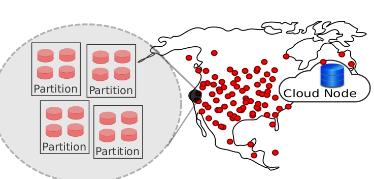

In UCSC EdgeLab, we study and build
distributed data management
systems. We are interested in systems that span large geographic
areas and infrastructures, including cloud and edge environments.

We target applications in the edge and IoT domain such as smart
spaces, autonomous cars, and mobile applications.

## EdgeLab Goal: WedgeDB

*Wide-area Edge DB (WedgeDB)* is a distributed database that span cloud
and edge nodes.  WedgeDB distributes storage and compute resources
close to users to enable fast access. In EdgeLab, we tackle various
research problems to realize WedgeDB. These research problems span
topics such as consensus, byzantine agreement, transaction
processing, and data indexing. Currently, the following are active
projects within the WedgeDB scope.


%### Project 1: Consensus across wide-area cloud-edge environments
%### Project 2: Distributed LSM indexes
%### Project 3:
 

## Select Recent Publications

1. [AnyLog: a Grand Unification of the Internet of Things](http://www.cs.umd.edu/~abadi/papers/anylogAbadiEtAl.pdf)
By D Abadi, O Arden, F Nawab, M Shadmon.
Published in CIDR 2020.

2. [Blockplane: A global-scale byzantizing middleware](http://www.nawab.me/Uploads/Blockplane_ICDE2019_cr.pdf)
F Nawab, M Sadoghi.
Published in ICDE 2019.

3. [Unifying consensus and atomic commitment for effective cloud data management](http://www.vldb.org/pvldb/vol12/p611-maiyya.pdf)
By S Maiyya, F Nawab, D Agrawal, A El Abbadi.
Published in VLDB 2019.

4. [Blockchain in IoT Systems: End-to-End Delay Evaluation](https://repository.kaust.edu.sa/bitstream/handle/10754/655903/08716500.pdf?sequence=1&isAllowed=y)
By M Alaslani, F Nawab, B Shihada.
Published in IEEE Internet of Things Journal 2019.

5. [Dpaxos: Managing data closer to users for low-latency and mobile applications](http://www.nawab.me/Uploads/Nawab_DPaxos_SIGMOD2018.pdf)
By F Nawab, D Agrawal, A El Abbadi.
Published in SIGMOD 2018.

## People

- Faisal Nawab, faculty. [http://nawab.me](http://nawab.me)
- Natasha Mittal, Ph.D. Student. (2018-now)
- Abhishek Singh, Ph.D. Student. (2018-now)
- Holly Casaletto, Ph.D. Student. (2018-now)
- Saeed Kargar, Ph. D. Student. (2019-now)
- Samaa Gazzaz, Ph.D. Student. (2019-now)
- BinBin Gu, Ph.D. Student. (2019-now)

## Talks

<iframe width="560" height="315"
src="https://www.youtube.com/embed/jq-4j5m8Ouw" frameborder="0"
allow="accelerometer; autoplay; encrypted-media; gyroscope;
picture-in-picture" allowfullscreen></iframe>

<iframe width="560" height="315"
src="https://www.youtube.com/embed/FrnYC15qBfI" frameborder="0"
allow="accelerometer; autoplay; encrypted-media; gyroscope;
picture-in-picture" allowfullscreen></iframe>

